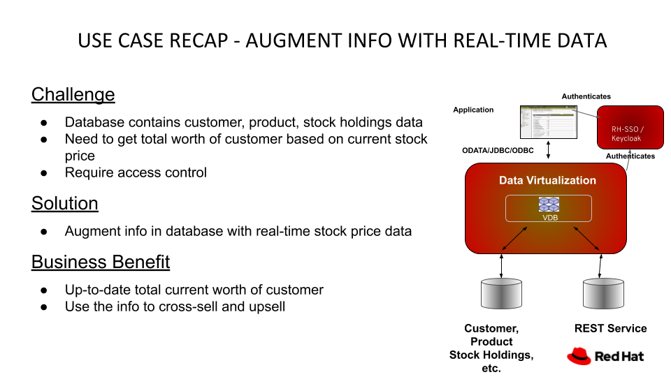

# spring-boot-for-data-virtualization

This is the repository for Part 3 and 4 in my Data Virtualization series: creating a VDB using Spring Boot and incorporating access control using RH-SSO/Keycloak.

You may want to watch the videos below:
- **Part 1 Introduction and Preview** at: https://youtu.be/lwLzqfgjGks
- **Part 2 Data Virtualization Operator** at: https://youtu.be/Ny1SwwHM_gc
- **Part 3 Spring Boot** at https://youtu.be/gjtLzxTsHi4
- **Part 4 RH-SSO/Keyclocak Integration** at https://youtu.be/L0yzS3QiPpU

## 1 Repository structure
Folders include:
- data-source-content - contains the sql file to populate the data source (PostgreSQL) and the Teiid (Data Virtualization) JDBC Driver
- images - contains the images for the readme file
- Keycloak - contains the export of the Keycloak realm **DV** which can be impoted into your Keycloak server
- sso-portfolio-vdb - the Spring Boot project which implements a Virtual Database to realise the use case described by the graphics below:

## 2 Data Source (PostgreSQL) Setup
You have to use the Catalog from the Openshift Console to set up a PostgreSQL instance with:
- Database Service Name: postgresql
- PostgreSQL Connection Username: user
- PostgreSQL Connection Password: password
- PostgreSQL Database Name: sampledb
and initialise the sampldb with the sql script: accounts-schema.sql.

## 3 VDB Deployment on Openshift
Login to Openshift and make sure you are in the correct project:
<pre>
oc login -u developer -p developer *yourOpenshiftCommandLineURL*
Login successful.

You have access to the following projects and can switch between them with 'oc project <projectname>':

    amq-streams
  * dv-demo
    image-service
    my-fuseonline
    my-rhpam
    odh

Using project "dv-demo".

</pre>
Change to the "sso-portfolio-vdb" directory. Create a secret containing the keystore for using SSL and a configmap containing the application.properties file. And then deploy the application.
<pre>
oc create secret generic sslsecret --from-file=src/main/resources/keystore.jks
oc create configmap image-service --from-file=src/main/resources/application.properties
mvn clean -P openshift fabric8:deploy
</pre>

You then create a secure route for the VDB using the Openshift Console. Remember to select:
- secured route: checked
- TLS Termination: Passthrough

Note that you need the Keycloak.auth-server-url entry in the application.properties file pointing to the Keycloak server for the Keycloak integration to work. At this time, you do not have the server URL as we have not set up the Keycloak server yet.
Once you have set up the Keycloak server, you can update the entry in the configmap created above from the Openshift console and delete your sso-portfolio-vdb pod and the replacement pod will pick up the URL from the updated configmap.

## 4 Keycloak Setup and Configuration
Follow the instructions in the video to install the Keycloak Operator and create a Keycloak instance and then import the **DV** realm using the realm-export.json file from the Keycloak Admin Console.

Note that you have to change the "data-integration" client setting: **Valid Redirect URIs** to
<pre>
yourVdbRoute/*
</pre>

## 5 VDB Interaction using ODATA
Use the following command from a browser:
<pre>
YourVdbROute/odata/portfolio/StockPrice('IBM')
YourVdbROute/odata/portfolio/StockPrice('IBM')/price/$value
YourVdbROute/odata/portfolio/StockPrice('IBM')?$format=json
YourVdbROuteodata/portfolio/CustomerHoldings?$filter=LastName eq 'Doe'&$format=json
YourVdbROute/odata/Portfolio/AccountValues?$top=5&$format=json
YourVdbROute/odata/portfolio/AccountValues('Doe')?$format=json
</pre>

Login with two different browsers using 2 different users (one with ReadRole and the other StockRole) to see the different behaviour.

## 6 VDB interaction using JDBC
I am using the Squirrel SQL client in my demo. You may use other SQL clients of your choosing. If you should want to use Squirrel SQL client, here is the link to the official site: http://squirrel-sql.sourceforge.net

From the Squirrel SQL Client, install the Teiid JDBC driver with Class Name: **org.teiid.jdbc.TeiidDriver** and set up 2 aliases with different users (one with ReadRole and the other with StockRole) and set the URL to: jdbc:teiid:portfolio@mm://127.0.0.1:31000

Login to Openshift and make sure you are on the correct project:
<pre>
$ oc login -u developer -p developer *yourOpenshiftCommandLineURL*
Login successful.

You have access to the following projects and can switch between them with 'oc project <projectname>':

    amq-streams
  * dv-demo
    image-service
    my-fuseonline
    my-rhpam
    odh

Using project "dv-demo".

</pre>

Issue the command to do port forwarding from port 31000 of the pod running the Spring Boot VDB to your local machine running Squirrl SQL client:
<pre>
oc port-forward $(oc get pods -o=jsonpath='{.items[0].metadata.name}' -l app=sso-portfolio-vdb) 31000
</pre>

Connect to the VDB using the 2 aliases one at a time. You can test the behaviour by executing the following SQL statements:
<pre>
select * from stockprice where symbol='IBM'

select * from customerholdings where lastname='Doe'

select * from accountvalues where lastname='Doe'

</pre>

ENJOY!!!